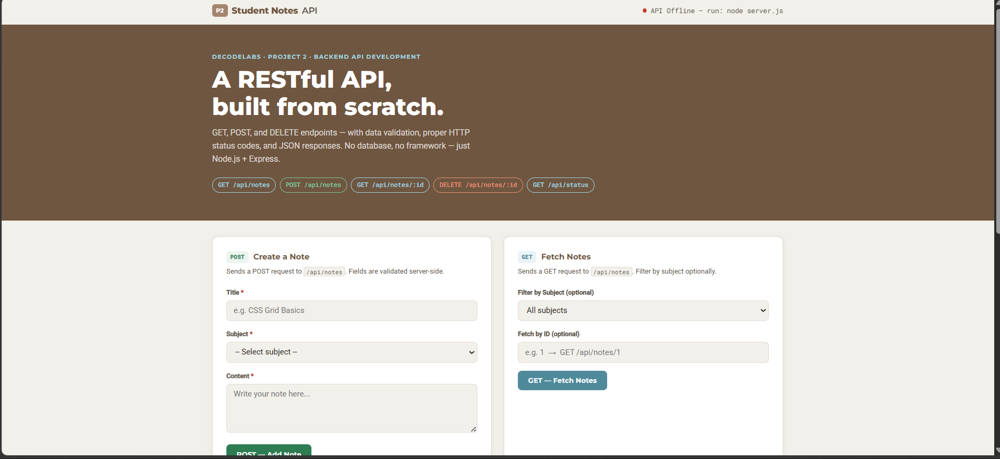

# 📋 Student Notes API – Project 2

A simple RESTful API built using **Node.js** and **Express.js** as part of the **DecodeLabs Full Stack Development Internship (Batch 2026)**.

---

## 📸 Project Preview



---

## 🚀 Features

- 📄 Create, Read & Delete Notes
- ⚡ RESTful API Endpoints
- ✅ Server-side Validation
- 📦 JSON Responses
- 🌐 CORS Enabled
- 💾 In-Memory Data Storage

---

## 🛠️ Tech Stack

- Node.js
- Express.js
- HTML5
- CSS3
- JavaScript

---

## 📁 Project Structure

```text
project2/
├── server.js
├── index.html
├── styles.css
├── app.js
├── package.json
├── preview.png
└── README.md
```

---

## ▶️ Getting Started

Install dependencies:

```bash
npm install
```

Run the server:

```bash
node server.js
```

Open your browser:

```
http://localhost:3000
```

---

## 📡 API Endpoints

- `GET /api/status`
- `GET /api/notes`
- `GET /api/notes/:id`
- `POST /api/notes`
- `DELETE /api/notes/:id`

---

## 👩‍💻 Author

**Riya Maheshwari**

🔗 GitHub: https://github.com/riya609

---